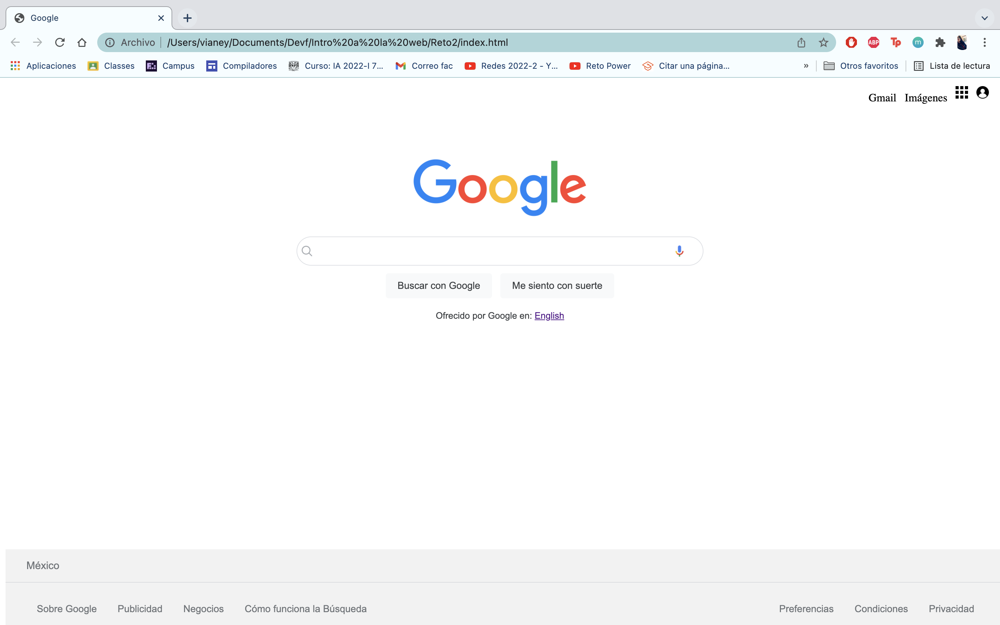

## Float y Position
Creamos un clon de Google, solamente usando Float y Position.
## Vistas que se hizo

- Página de Google

## Autora :bust_in_silhouette:
- [VianeyAileen](https://github.com/VianeyAileen) (Vianey Aileen Borras Pablo).