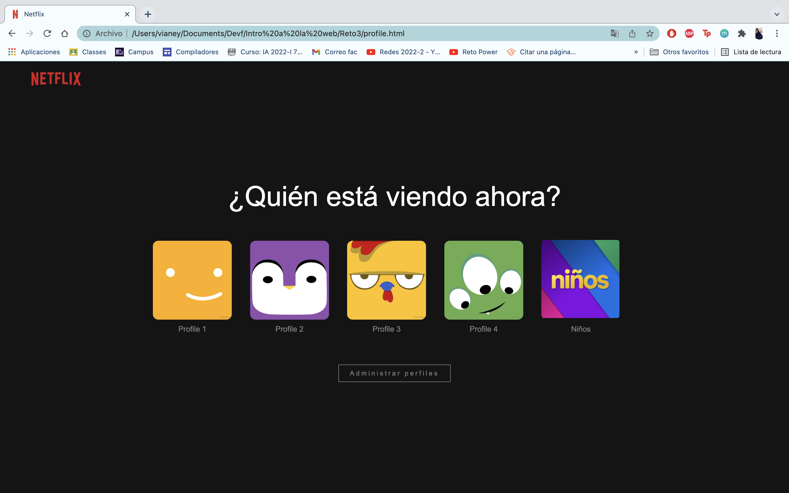

## Reto 3: Clon de Netflix
Creamos un clon de Netflix usando HTML y CSS, sólo se hicieron las vistas de las páginas de Iniciar Sesión, seleccionar perfil y la principal.

## Vistas que se hicieron

- Iniciar Sesión

- Seleccionar perfil

- Página principal

## Autora :bust_in_silhouette:
- [VianeyAileen](https://github.com/VianeyAileen) (Vianey Aileen Borras Pablo).